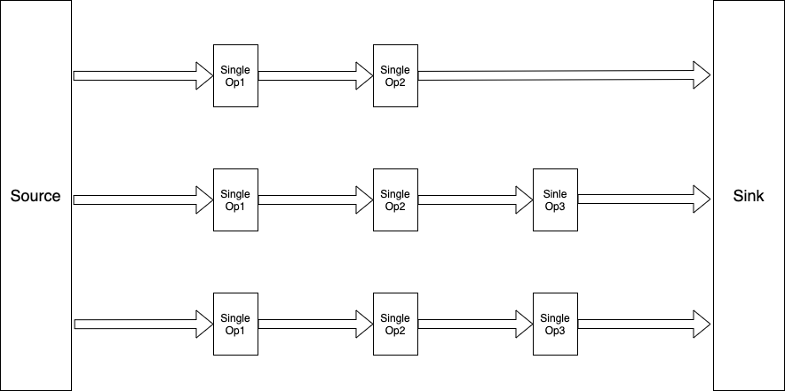

# pipe-flow
A data processing library that allows the creation of parallel pipelines that end in a common point.

## Flow diagram



## Source
A data source that holds data that will be passed through pipelines. For now, it is limited to taking in a CSV 
formatted file. The CSV is read and a pipeline is created for each column. The user is responsible for creating
the function that runs on a specific column of the CSV file.

## Pipe
The structure through which data flows. The pipeline applies the specified user function to either all the data points
independently or perform an aggregation of all the data points to create a common summary. The data can either pass 
through the pipeline and end straight in a sink, or it can go through a junction.

## Junction
The junction is used as an intermediary step in data processing. It can either serve as a breakpoint for monitoring how
data is being transformed or it can hold a connection to another pipeline to which data will be passed. Once data passes
through all the specified pipelines and junctions, it ends in a sink.

## Sink
The sink is a data repository that aggregates all the data that pipeline operations were performed on and creates a new
CSV file that holds the results. The results may not be structured the same way as the input CSV is because of the 
different pipeline functions that can be created. For example, a CSV column may end with a summary statistic while 
another may end with independently modified values.

### Code examples
```go
package example

import "fmt"

fmt.Printf("Flav, add code examples")
```
